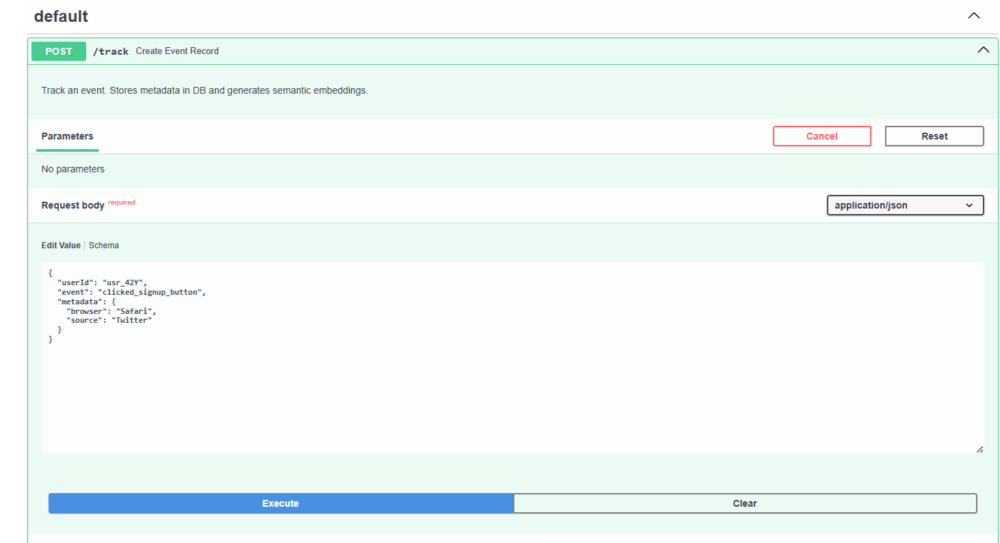
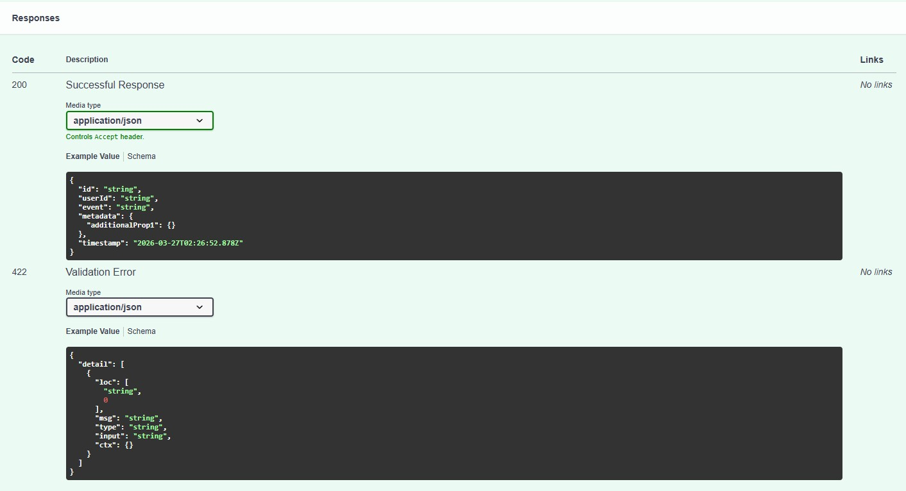
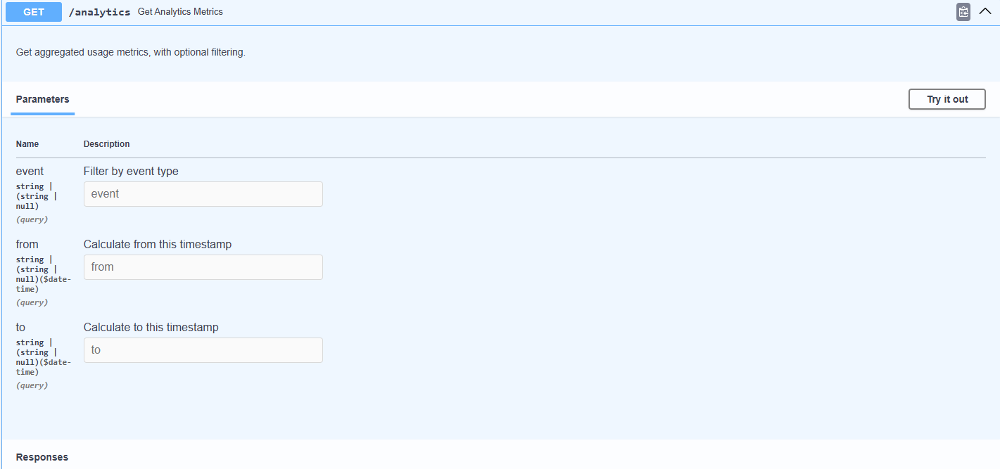
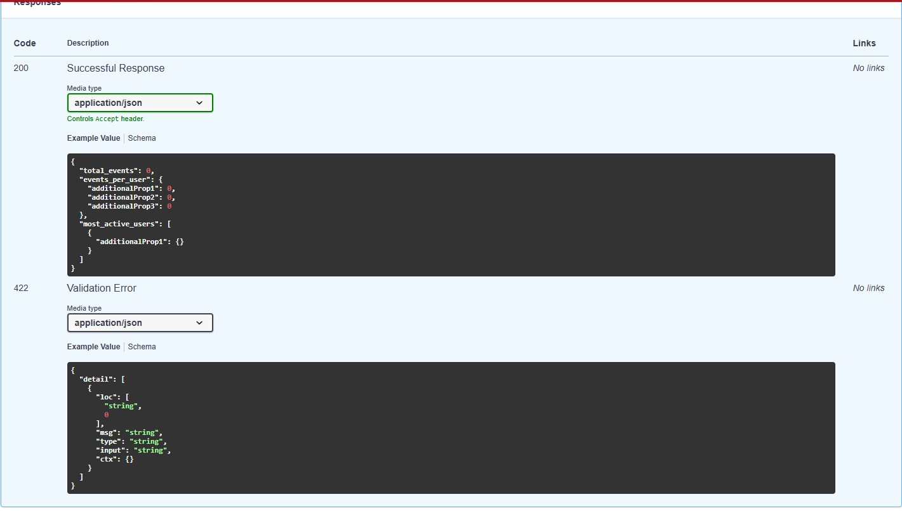
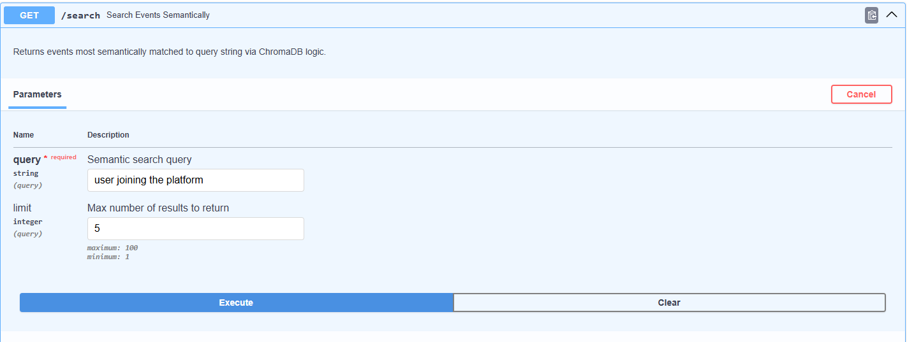
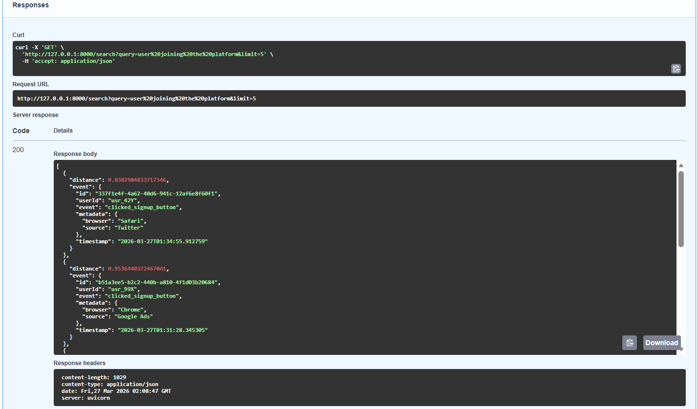

# User Analytics & Semantic Search System

A backend system that tracks user events, providing basic analytics, and enabling AI-powered semantic search using vector embeddings. Built with FastAPI, PostgreSQL/SQLite, and ChromaDB.

## 1. Setup Instructions

### Prerequisites
- Python 3.9+
- Pip
- Virtual Environment (recommended)

### Installation

1. **Clone the repository and navigate to the project directory:**
   ```bash
   cd event_tracker
   ```

2. **Set up a virtual environment:**
   ```bash
   python -m venv venv
   # On Windows:
   venv\Scripts\activate
   # On MacOS/Linux:
   source venv/bin/activate
   ```

3. **Install the dependencies:**
   ```bash
   pip install -r requirements.txt
   ```

4. **Environment Configuration:**
   Copy the example environment file.
   ```bash
   cp .env.example .env
   ```
   *Note: If `SUPABASE_DATABASE_URL` is omitted, the application will default to a local SQLite schema (`events.db`) which is perfectly viable for testing.*

5. **Start the Application:**
   ```bash
   uvicorn app.main:app --reload
   ```
   The API will be running at `http://127.0.0.1:8000`. You can access the automatic interactive API documentation (Swagger) at `http://127.0.0.1:8000/docs`.

---

## 2. API Documentation

### Event Tracking API

**`POST /track`**
Stores an event in the relational database and generates a semantic embedding which is stored in the vector database.




*Example `curl` Request:*
```bash
curl -X 'POST' \
  'http://127.0.0.1:8000/track' \
  -H 'accept: application/json' \
  -H 'Content-Type: application/json' \
  -d '{
  "userId": "usr_42Y",
  "event": "clicked_signup_button",
  "metadata": {
    "browser": "Safari",
    "source": "Twitter"
  }
}'
```

*Response (200 OK):*
```json
{
  "id": "337f1e4f-4a62-40d6-941c-12af6e8f60f1",
  "userId": "usr_42Y",
  "event": "clicked_signup_button",
  "metadata": {
    "browser": "Safari",
    "source": "Twitter"
  },
  "timestamp": "2026-03-27T01:34:55.912759"
}
```

### Analytics API

**`GET /analytics`**
Retrieves basic aggregate analytics of user behavior.




*Query Parameters (Optional):*
- `event` (string | null): Filter by event type
- `from` (string | null, format: date-time): Calculate from this timestamp
- `to` (string | null, format: date-time): Calculate to this timestamp

*Sample Request:*
`GET /analytics?event=click&from=2026-01-01&to=2026-12-31`

*Response (200 OK) Schema Example:*
```json
{
  "total_events": 0,
  "events_per_user": {
    "additionalProp1": 0,
    "additionalProp2": 0,
    "additionalProp3": 0
  },
  "most_active_users": [
    {
      "additionalProp1": {}
    }
  ]
}
```

*Response (422 Validation Error) Example:*
```json
{
  "detail": [
    {
      "loc": [
        "string",
        0
      ],
      "msg": "string",
      "type": "string",
      "input": "string",
      "ctx": {}
    }
  ]
}
```

### Semantic Search API

**`GET /search`**
Converts a query string into an embedding and performs a similarity search across all stored events.




*Example `curl` Request:*
```bash
curl -X 'GET' \
  'http://127.0.0.1:8000/search?query=user%20joining%20the%20platform&limit=5' \
  -H 'accept: application/json'
```

*Response (200 OK):*
```json
[
  {
    "distance": 0.8302984833717346,
    "event": {
      "id": "337f1e4f-4a62-40d6-941c-12af6e8f60f1",
      "userId": "usr_42Y",
      "event": "clicked_signup_button",
      "metadata": {
        "browser": "Safari",
        "source": "Twitter"
      },
      "timestamp": "2026-03-27T01:34:55.912759"
    }
  },
  {
    "distance": 0.9536440372467041,
    "event": {
      "id": "b51a3ee5-b2c2-440b-a81d-4f1d03b20684",
      "userId": "usr_99X",
      "event": "clicked_signup_button",
      "metadata": {
        "browser": "Chrome",
        "source": "Google Ads"
      },
      "timestamp": "2026-03-27T01:31:28.345305"
    }
  }
]
```

### Similar Users API

**`GET /similar-users`**
Identifies users with similar behavior patterns by computing the overall behavioral vector of the target user and comparing it to other users using cosine similarity.

*Query Parameters:*
- `userId` (string, required): The target user ID.
- `limit` (integer, optional): Maximum similar users to return (default: 5).

*Sample Request:*
`GET /similar-users?userId=123`

*Response (200 OK):*
```json
[
  {
    "userId": "456",
    "similarityScore": 0.8932
  }
]
```

---

## 3. Explanation of Design Decisions

### 1. API Design and Structure
The application employs a modular **FastAPI** structure, strictly separating concerns:
- `app/api/endpoints.py` acts as the routing layer, purely handling HTTP validation (via standard Pydantic models).
- `app/services/` contains distinct business logic files (e.g. `event_service.py`, `similar_users_service.py`). This prevents bloated files and handles core logic independently.
- `app/db/` isolates all database connections, SQLAlchemy ORM models, and Vector db instances.

### 2. Database Schema Design
- **Relational Data (PostgreSQL / SQLite via SQLAlchemy):** `Event` table uses standard normalized columns (`id`, `user_id`, `event_type`, `timestamp`) with an additional optimized `JSON` column for `metadata` to handle flexible, arbitrary data shapes. The database is abstracted via SQLAlchemy allowing it to scale from SQLite locally to scalable Postgres on services like Supabase.
- **Vector Space (ChromaDB):** Integrated locally to automatically vectorize text and persist it without needing external API dependencies for the core MVP format. It maps cleanly back to the Postgres source via `id`.

### 3. Code Clarity and Organization
- **Pydantic Validation**: All requests and responses are strongly typed in `schemas.py`, generating the free Swagger UI logic automatically and preventing malformed injections.
- **Dependency Injection**: FastApi's `Depends(get_db)` is used dynamically throughout the endpoints to ensure transactional database sessions are opened and safely closed per-request without leaking connections.

### 4. Correctness of Implementation
- **Analytics Method**: Rather than pulling thousands of records into Python memory, the analytics aggregation uses efficient SQL aggregation (e.g. `func.count(Event.id)` with `.group_by(Event.user_id)`) optimizing database loads naturally.
- **Semantic Behavior Modeling**: The Similar Users feature isn't just relying on simple string counts. It dynamically computes a unified multi-dimensional behavior profile by gathering all historical vector representations of a user, resolving the mean vector using `numpy`, and then executing a fully scalable exact cosine similarity dot product against peer clusters.

### 5. Thoughtfulness in Handling Scalability and Edge Cases
- **Caching**: The Similar Users endpoint applies `functools.lru_cache` when computing `_get_cached_user_vector`. This is exceptionally useful; since evaluating math matrices for large historical databases is computationally taxing, caching the resultant vector utilizing a tuple hash significantly reduces server load for iterative recalculations.
- **Data Safety and Defaults**: Edge cases (like empty lists/arrays, zero vectors, non-existent users) returning from DB abstractions are managed natively to return `0.0` or informative generic HTTP `404` errors rather than suffering backend 500 fatal server errors.
- **Pagination Support**: APIs utilizing unbounded data (like Search and Similar-Users) automatically support query limits constrained cleanly by standard `< le` bounds in FastAPI schema to prevent query bloats and memory faults.
